# Resource Server API Flow Diagram

```mermaid
graph TB
    %% Client and External Systems
    Client[Client Application]
    CDN[CDN Provider]
    GCS[Google Cloud Storage]
    R2[Cloudflare R2]
    
    %% Main API Server
    API[Resource Server API]
    
    %% Core Components
    HealthCheck[Health Check Handler]
    ResourceDef[Resource Definition Handler]
    ProviderHandler[Provider Handler]
    FileOps[File Operations Handler]
    MultipartHandler[Multipart Upload Handler]
    AchievementHandler[Achievement Handler]
    
    %% Data Layer
    DB[(PostgreSQL Database)]
    
    %% Resource Definitions Flow
    Client -->|GET /api/v1/health| HealthCheck
    HealthCheck --> DB
    HealthCheck -->|200 OK| Client
    
    Client -->|GET /api/v1/resources/definitions| ResourceDef
    Client -->|GET /api/v1/resources/definitions/:name| ResourceDef
    ResourceDef -->|Return definitions| Client
    
    %% Provider Information Flow
    Client -->|GET /api/v1/resources/providers| ProviderHandler
    Client -->|GET /api/v1/resources/providers/:name| ProviderHandler
    ProviderHandler -->|Return capabilities| Client
    
    %% File Operations Flow
    Client -->|GET /api/v1/resources/:provider/:definition| FileOps
    FileOps -->|List files| CDN
    FileOps -->|List files| GCS
    FileOps -->|List files| R2
    CDN -->|File list| FileOps
    GCS -->|File list| FileOps
    R2 -->|File list| FileOps
    FileOps -->|Paginated results| Client
    
    %% Upload Flow
    Client -->|POST /api/v1/resources/:provider/:definition/upload| FileOps
    FileOps -->|Generate signed URL| CDN
    FileOps -->|Generate signed URL| GCS
    FileOps -->|Generate signed URL| R2
    CDN -->|Signed URL| FileOps
    GCS -->|Signed URL| FileOps
    R2 -->|Signed URL| FileOps
    FileOps -->|Upload URL + metadata| Client
    Client -->|Upload file| CDN
    Client -->|Upload file| GCS
    Client -->|Upload file| R2
    
    %% Download Flow
    Client -->|POST /api/v1/resources/:provider/*/download| FileOps
    FileOps -->|Generate download URL| CDN
    FileOps -->|Generate download URL| GCS
    FileOps -->|Generate download URL| R2
    CDN -->|Download URL| FileOps
    GCS -->|Download URL| FileOps
    R2 -->|Download URL| FileOps
    FileOps -->|Download URL| Client
    Client -->|Download file| CDN
    Client -->|Download file| GCS
    Client -->|Download file| R2
    
    %% Metadata Operations
    Client -->|GET /api/v1/resources/:provider/*/metadata| FileOps
    Client -->|PUT /api/v1/resources/:provider/*/metadata| FileOps
    FileOps -->|Get/Update metadata| CDN
    FileOps -->|Get/Update metadata| GCS
    FileOps -->|Get/Update metadata| R2
    CDN -->|Metadata| FileOps
    GCS -->|Metadata| FileOps
    R2 -->|Metadata| FileOps
    FileOps -->|Metadata response| Client
    
    %% Delete Operations
    Client -->|DELETE /api/v1/resources/:provider/*| FileOps
    FileOps -->|Delete file| CDN
    FileOps -->|Delete file| GCS
    FileOps -->|Delete file| R2
    CDN -->|Deletion confirmed| FileOps
    GCS -->|Deletion confirmed| FileOps
    R2 -->|Deletion confirmed| FileOps
    FileOps -->|Success response| Client
    
    %% Multipart Upload Flow
    Client -->|POST /api/v1/resources/multipart/init| MultipartHandler
    MultipartHandler -->|Store upload metadata| DB
    MultipartHandler -->|Initialize multipart| CDN
    MultipartHandler -->|Initialize multipart| GCS
    MultipartHandler -->|Initialize multipart| R2
    CDN -->|Upload ID| MultipartHandler
    GCS -->|Upload ID| MultipartHandler
    R2 -->|Upload ID| MultipartHandler
    MultipartHandler -->|Upload ID + constraints| Client
    
    Client -->|POST /api/v1/resources/multipart/urls| MultipartHandler
    MultipartHandler -->|Get upload metadata| DB
    MultipartHandler -->|Generate part URLs| CDN
    MultipartHandler -->|Generate part URLs| GCS
    MultipartHandler -->|Generate part URLs| R2
    CDN -->|Part URLs| MultipartHandler
    GCS -->|Part URLs| MultipartHandler
    R2 -->|Part URLs| MultipartHandler
    MultipartHandler -->|Part URLs + complete/abort URLs| Client
    
    Client -->|Upload parts| CDN
    Client -->|Upload parts| GCS
    Client -->|Upload parts| R2
    
    Client -->|Complete multipart| CDN
    Client -->|Complete multipart| GCS
    Client -->|Complete multipart| R2
    
    %% Achievement Management Flow
    Client -->|GET /api/v1/achievements/| AchievementHandler
    AchievementHandler -->|Query achievements| DB
    DB -->|Achievement list| AchievementHandler
    AchievementHandler -->|Paginated achievements| Client
    
    Client -->|POST /api/v1/achievements/| AchievementHandler
    AchievementHandler -->|Create achievement| DB
    AchievementHandler -->|Generate upload URL| CDN
    AchievementHandler -->|Generate upload URL| GCS
    AchievementHandler -->|Generate upload URL| R2
    CDN -->|Upload URL| AchievementHandler
    GCS -->|Upload URL| AchievementHandler
    R2 -->|Upload URL| AchievementHandler
    DB -->|Achievement created| AchievementHandler
    AchievementHandler -->|Achievement + upload URL| Client
    
    Client -->|GET /api/v1/achievements/:id| AchievementHandler
    AchievementHandler -->|Query by ID| DB
    DB -->|Achievement details| AchievementHandler
    AchievementHandler -->|Achievement data| Client
    
    Client -->|PUT /api/v1/achievements/:id/icon| AchievementHandler
    AchievementHandler -->|Update icon metadata| DB
    AchievementHandler -->|Generate new upload URL| CDN
    AchievementHandler -->|Generate new upload URL| GCS
    AchievementHandler -->|Generate new upload URL| R2
    CDN -->|New upload URL| AchievementHandler
    GCS -->|New upload URL| AchievementHandler
    R2 -->|New upload URL| AchievementHandler
    DB -->|Update confirmed| AchievementHandler
    AchievementHandler -->|New upload URL| Client
    
    %% Upload Confirmation Flow
    Client -->|POST /api/v1/achievements/uploads/:id/confirm| AchievementHandler
    AchievementHandler -->|Update upload status| DB
    AchievementHandler -->|Verify file exists| CDN
    AchievementHandler -->|Verify file exists| GCS
    AchievementHandler -->|Verify file exists| R2
    CDN -->|File verification| AchievementHandler
    GCS -->|File verification| AchievementHandler
    R2 -->|File verification| AchievementHandler
    DB -->|Status updated| AchievementHandler
    AchievementHandler -->|Confirmation response| Client
    
    Client -->|POST /api/v1/achievements/uploads/:id/multipart| AchievementHandler
    AchievementHandler -->|Get upload metadata| DB
    AchievementHandler -->|Generate part URLs| CDN
    AchievementHandler -->|Generate part URLs| GCS
    AchievementHandler -->|Generate part URLs| R2
    CDN -->|Part URLs| AchievementHandler
    GCS -->|Part URLs| AchievementHandler
    R2 -->|Part URLs| AchievementHandler
    AchievementHandler -->|Multipart URLs| Client
    
    %% Styling
    classDef clientClass fill:#e1f5fe
    classDef apiClass fill:#f3e5f5
    classDef handlerClass fill:#e8f5e8
    classDef storageClass fill:#fff3e0
    classDef dbClass fill:#fce4ec
    
    class Client clientClass
    class API apiClass
    class HealthCheck,ResourceDef,ProviderHandler,FileOps,MultipartHandler,AchievementHandler handlerClass
    class CDN,GCS,R2 storageClass
    class DB dbClass
```

## Flow Legend

### Core API Flows
1. **Health Check**: Simple database connectivity verification
2. **Resource Definitions**: Static configuration of resource types and their parameters
3. **Provider Information**: Storage provider capabilities and constraints

### File Management Flows
4. **File Listing**: Paginated file discovery across providers
5. **Upload Generation**: Signed URL creation for direct client uploads
6. **Download Generation**: Signed URL creation for secure downloads
7. **Metadata Operations**: File metadata retrieval and updates
8. **File Deletion**: Secure file removal from storage providers

### Advanced Upload Flows
9. **Multipart Upload**: Large file upload workflow with multiple parts
10. **Upload Confirmation**: Post-upload verification and metadata finalization

### Achievement Management Flows
11. **Achievement CRUD**: Create, read, update operations for achievements
12. **Icon Management**: Specialized workflows for achievement icon uploads
13. **Upload Tracking**: Status tracking for achievement-related uploads

### Data Flow Patterns
- **Request/Response**: Standard HTTP API interactions
- **Signed URL Generation**: Secure, time-limited access to storage providers
- **Database Operations**: Persistent storage of metadata and configurations
- **Multi-Provider Support**: Abstracted operations across CDN, GCS, and R2
- **Workflow Orchestration**: Complex multi-step operations like multipart uploads

This diagram represents all the resource flows tested in the end-to-end test plan, showing how data moves between clients, the API server, storage providers, and the database.