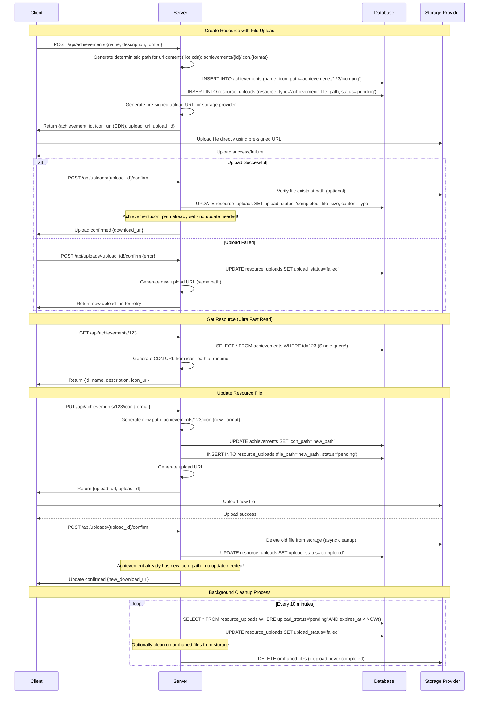
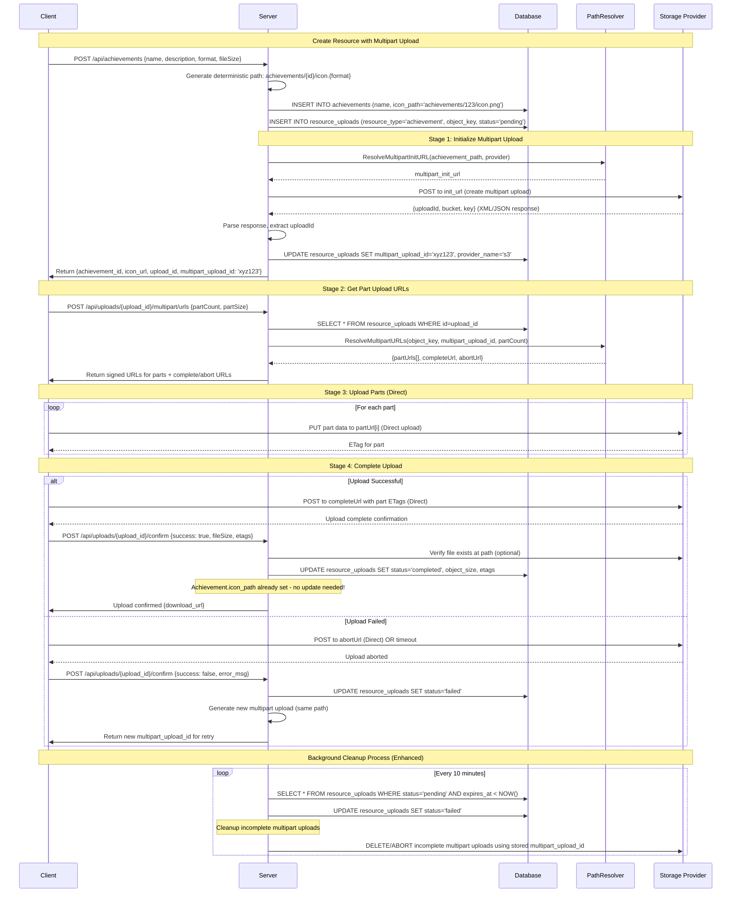

# Resource Management Flow

## Database Schema

```sql
-- Business table optimized for fast reads
CREATE TABLE achievements (
    id UUID PRIMARY KEY,
    name VARCHAR(255) NOT NULL,
    description TEXT,
    icon_path VARCHAR(255),  -- Relative path of cdn: 'achievements/123/icon.png'
    created_at TIMESTAMP DEFAULT NOW(),
    updated_at TIMESTAMP DEFAULT NOW()
);

-- Upload tracking table (separate from business logic)
CREATE TABLE resource_uploads (
    id UUID PRIMARY KEY,    

    resource_type VARCHAR(50) NOT NULL,  -- 'achievement', 'workout', etc
    resource_id VARCHAR NOT NULL,           -- Reference to business table
    resource_field VARCHAR(50),                -- 'icon_path', 'banner_path'
    resource_value VARCHAR(500) NOT NULL, -- CDN path: 'achievements/123/icon.png'context
    
    -- Status tracking
    status VARCHAR(20) NOT NULL,         -- 'initializing', 'pending', 'uploading', 
  'completing', 'completed', 'failed', 'aborted'
    status_reason TEXT,                   -- Error messages or failure reasons

    -- Object metadata (populated after upload)
    object_key VARCHAR(255) NOT NULL,     -- Relative path in storage providers(aws, r2, gcs): 'achievements/123/icon.png'
    object_size BIGINT,
    object_content_type VARCHAR(100),
    object_metadata JSONB,
    -- ETag tracking (unified for simple and multipart uploads)
    object_etags JSONB,                         -- Simple: "abc123" | Multipart: [{"part": 1, "etag": "abc123"}, {"part": 2, "etag": "def456"}]
    
    -- Multipart upload fields (NULL for simple uploads)
    multipart_upload_id VARCHAR(255),    -- Provider's multipart upload ID
    total_parts INT,                     -- Expected number of parts for multipart upload
    
    -- Request context (optional)
    upload_type VARCHAR(20) NOT NULL, -- 'simple', 'multipart'
    scope_type VARCHAR(50), 
    scope_value VARCHAR(100),
    params JSONB, 
    storage_provider VARCHAR(50) NOT NULL,  -- 's3', 'gcs', 'r2', etc
    cdn_provider VARCHAR(50),          -- 'custom cdn', 'r2', etc
    
    -- Lifecycle
    created_at TIMESTAMP DEFAULT NOW(),
    updated_at TIMESTAMP DEFAULT NOW(),
    completed_at TIMESTAMP,
    expires_at TIMESTAMP NOT NULL,       -- Upload URL expiry

    INDEX idx_pending_cleanup (status, expires_at),
    INDEX idx_resource_lookup (resource_type, resource_id),
    INDEX idx_resource_key (resource_key),
    INDEX idx_multipart_uploads (multipart_upload_id) WHERE multipart_upload_id IS NOT NULL
);
```

## Sequence Diagram



## Implementation Details

### 1. Create Achievement with Upload

```go
type CreateAchievementRequest struct {
    Name        string `json:"name" validate:"required"`
    Description string `json:"description"`
    Format      string `json:"format" validate:"oneof=png jpg svg"`
}

type CreateAchievementResponse struct {
    ID        string `json:"id"`
    Name      string `json:"name"`
    IconURL   string `json:"icon_url"`   // CDN URL for downloads
    UploadURL string `json:"upload_url"` // Pre-signed URL for upload
    UploadID  string `json:"upload_id"`  // For confirmation
    ExpiresAt int64  `json:"expires_at"`
}

func (h *Handler) CreateAchievement(ctx context.Context, req *CreateAchievementRequest) (*CreateAchievementResponse, error) {
    achievementID := uuid.New()
    
    // Generate deterministic path
    iconPath := fmt.Sprintf("achievements/%s/icon.%s", achievementID, req.Format)
    
    // Create achievement record immediately
    achievement := &Achievement{
        ID:          achievementID,
        Name:        req.Name,
        Description: req.Description,
        IconPath:    iconPath,
    }
    if err := h.db.Create(achievement).Error; err != nil {
        return nil, err
    }
    
    // Create upload tracking record
    uploadID := uuid.New()
    upload := &ResourceUpload{
        ID:           uploadID,
        ResourceType: "achievement",
        ResourceID:   achievementID,
        FilePath:     iconPath,
        Status: "pending",
        ExpiresAt:    time.Now().Add(1 * time.Hour),
    }
    if err := h.db.Create(upload).Error; err != nil {
        return nil, err
    }
    
    // Generate upload URL
    uploadURL, err := h.storage.GenerateUploadURL(iconPath, &provider.UploadURLOptions{
        Expiry: &[]time.Duration{time.Hour}[0],
    })
    if err != nil {
        return nil, err
    }
    
    return &CreateAchievementResponse{
        ID:        achievementID.String(),
        Name:      req.Name,
        IconURL:   h.cdn.GetURL(iconPath),
        UploadURL: uploadURL.URL,
        UploadID:  uploadID.String(),
        ExpiresAt: time.Now().Add(1 * time.Hour).Unix(),
    }, nil
}
```

### 2. Fast Read (Single Query)

```go
func (h *Handler) GetAchievement(ctx context.Context, id string) (*Achievement, error) {
    var achievement Achievement
    
    // Single table query - ultra fast!
    if err := h.db.Where("id = ?", id).First(&achievement).Error; err != nil {
        return nil, err
    }
    
    // Generate URL at runtime (allows provider switching)
    if achievement.IconPath != "" {
        achievement.IconURL = h.cdn.GetURL(achievement.IconPath)
    }
    
    return &achievement, nil
}
```

### 3. Confirm Upload

```go
type ConfirmUploadRequest struct {
    Success   bool   `json:"success"`
    ErrorMsg  string `json:"error_msg,omitempty"`
    FileSize  int64  `json:"file_size,omitempty"`
}

func (h *Handler) ConfirmUpload(ctx context.Context, uploadID string, req *ConfirmUploadRequest) error {
    var upload ResourceUpload
    if err := h.db.Where("id = ?", uploadID).First(&upload).Error; err != nil {
        return err
    }
    
    if req.Success {
        // Optional: Verify file actually exists
        if h.config.VerifyUploads {
            exists, err := h.storage.FileExists(upload.FilePath)
            if err != nil || !exists {
                upload.Status = "failed"
                h.db.Save(&upload)
                return fmt.Errorf("file verification failed")
            }
        }
        
        // Mark as completed
        upload.Status = "completed"
        upload.FileSize = req.FileSize
        if err := h.db.Save(&upload).Error; err != nil {
            return err
        }
        
        // Achievement already has the path - no update needed!
        return nil
    } else {
        // Mark as failed
        upload.Status = "failed"
        return h.db.Save(&upload).Error
    }
}
```

### 4. Update Icon

```go
func (h *Handler) UpdateIcon(ctx context.Context, achievementID, format string) (*UpdateIconResponse, error) {
    // Generate new path
    newPath := fmt.Sprintf("achievements/%s/icon.%s", achievementID, format)
    
    // Update achievement with new path immediately
    if err := h.db.Model(&Achievement{}).
        Where("id = ?", achievementID).
        Update("icon_path", newPath).Error; err != nil {
        return nil, err
    }
    
    // Create new upload tracking
    uploadID := uuid.New()
    upload := &ResourceUpload{
        ID:           uploadID,
        ResourceType: "achievement",
        ResourceID:   achievementID,
        FilePath:     newPath,
        Status: "pending",
        ExpiresAt:    time.Now().Add(1 * time.Hour),
    }
    if err := h.db.Create(upload).Error; err != nil {
        return nil, err
    }
    
    // Generate upload URL
    uploadURL, err := h.storage.GenerateUploadURL(newPath, &provider.UploadURLOptions{
        Expiry: &[]time.Duration{time.Hour}[0],
    })
    if err != nil {
        return nil, err
    }
    
    return &UpdateIconResponse{
        UploadURL: uploadURL.URL,
        UploadID:  uploadID.String(),
        ExpiresAt: time.Now().Add(1 * time.Hour).Unix(),
    }, nil
}
```

### 5. Cleanup Job

```go
func (h *Handler) CleanupExpiredUploads(ctx context.Context) error {
    var expiredUploads []ResourceUpload
    
    // Find expired pending uploads
    if err := h.db.Where("upload_status = ? AND expires_at < ?", 
        "pending", time.Now()).Find(&expiredUploads).Error; err != nil {
        return err
    }
    
    for _, upload := range expiredUploads {
        // Mark as failed
        upload.Status = "failed"
        h.db.Save(&upload)
        
        // Optional: Delete orphaned file from storage
        if h.config.CleanupOrphanedFiles {
            go h.storage.DeleteFile(upload.FilePath) // Async cleanup
        }
    }
    
    return nil
}
```

## Multipart Upload Flow

### Single Table Design Rationale

The multipart upload fields are integrated directly into the `resource_uploads` table for several reasons:

1. **Unified Tracking**: A single `upload_id` tracks the entire upload lifecycle
2. **Atomic Operations**: All state changes happen in one table, avoiding distributed transaction concerns
3. **Query Simplicity**: No JOINs needed to check upload status or retrieve multipart details
4. **Efficient Cleanup**: Background jobs can query a single table for expired uploads

For most uploads (95%+), the `multipart_upload_id`, `total_parts`, and `etags` will contain only simple data, adding minimal overhead while maintaining operational simplicity.

### ETag and Parts Tracking Design

The unified approach uses two complementary fields:

- **`etags` (JSONB)**: Stores ETag data for both simple and multipart uploads
  - Simple upload: `"abc123def456"` (just the ETag string)
  - Multipart upload: `[{"part": 1, "etag": "abc123"}, {"part": 2, "etag": "def456"}]` (array of part objects)

- **`total_parts` (INT)**: NULL for simple uploads, contains expected part count for multipart uploads
  - Used for validation during completion
  - Enables efficient queries to find incomplete multipart uploads
  - Set when client requests part URLs (stage 2 of multipart flow)

**Benefits:**
1. **Type Safety**: JSONB allows structured queries on multipart data
2. **Validation**: Can verify all parts are present before completion  
3. **Debugging**: Easy to see which parts are missing or duplicated
4. **Cleanup**: Can identify stalled multipart uploads by comparing etags array length to total_parts

### Multipart Sequence Diagram



### Multipart Implementation Details

#### 1. Initialize Multipart Upload

```go
type CreateAchievementMultipartRequest struct {
    Name        string `json:"name" validate:"required"`
    Description string `json:"description"`
    Format      string `json:"format" validate:"oneof=png jpg svg"`
    FileSize    int64  `json:"file_size" validate:"required,min=1"`
}

type CreateAchievementMultipartResponse struct {
    ID                 string `json:"id"`
    Name               string `json:"name"`
    IconURL            string `json:"icon_url"`
    UploadID           string `json:"upload_id"`
    MultipartUploadID  string `json:"multipart_upload_id"`
    ExpiresAt          int64  `json:"expires_at"`
}

func (h *Handler) CreateAchievementMultipart(ctx context.Context, req *CreateAchievementMultipartRequest) (*CreateAchievementMultipartResponse, error) {
    achievementID := uuid.New()
    
    // Generate deterministic path using PathResolver
    iconPath, err := h.pathResolver.ResolveContentPath("achievement", map[string]string{
        "achievement_id": achievementID.String(),
        "format": req.Format,
    })
    if err != nil {
        return nil, err
    }
    
    // Create achievement record immediately
    achievement := &Achievement{
        ID:          achievementID,
        Name:        req.Name,
        Description: req.Description,
        IconPath:    iconPath,
    }
    if err := h.db.Create(achievement).Error; err != nil {
        return nil, err
    }
    
    // Create upload tracking record
    uploadID := uuid.New()
    upload := &ResourceUpload{
        ID:           uploadID,
        ResourceType: "achievement",
        ResourceID:   achievementID.String(),
        ObjectKey:    iconPath,
        Status:       "pending",
        ExpiresAt:    time.Now().Add(1 * time.Hour),
    }
    if err := h.db.Create(upload).Error; err != nil {
        return nil, err
    }
    
    // Initialize multipart upload
    initURL, err := h.pathResolver.ResolveMultipartInitURL(iconPath)
    if err != nil {
        return nil, err
    }
    
    multipartUploadID, err := h.storage.InitiateMultipartUpload(initURL)
    if err != nil {
        return nil, err
    }
    
    // Update upload record with multipart ID
    upload.MultipartUploadID = multipartUploadID
    upload.ProviderName = h.storage.GetProviderName()
    if err := h.db.Save(upload).Error; err != nil {
        return nil, err
    }
    
    return &CreateAchievementMultipartResponse{
        ID:                achievementID.String(),
        Name:              req.Name,
        IconURL:           h.cdn.GetURL(iconPath),
        UploadID:          uploadID.String(),
        MultipartUploadID: multipartUploadID,
        ExpiresAt:         time.Now().Add(1 * time.Hour).Unix(),
    }, nil
}
```

#### 2. Get Part Upload URLs

```go
type GetMultipartURLsRequest struct {
    PartCount int `json:"part_count" validate:"required,min=1,max=10000"`
    PartSize  int `json:"part_size" validate:"required,min=5242880"` // Min 5MB
}

type GetMultipartURLsResponse struct {
    PartURLs    []PartURL `json:"part_urls"`
    CompleteURL string    `json:"complete_url"`
    AbortURL    string    `json:"abort_url"`
}

type PartURL struct {
    PartNumber int    `json:"part_number"`
    URL        string `json:"url"`
}

func (h *Handler) GetMultipartURLs(ctx context.Context, uploadID string, req *GetMultipartURLsRequest) (*GetMultipartURLsResponse, error) {
    var upload ResourceUpload
    if err := h.db.Where("id = ?", uploadID).First(&upload).Error; err != nil {
        return nil, err
    }
    
    if upload.Status != "pending" {
        return nil, fmt.Errorf("upload is not in pending state")
    }
    
    // Store total parts count for validation during completion
    upload.TotalParts = req.PartCount
    if err := h.db.Save(&upload).Error; err != nil {
        return nil, err
    }
    
    urls, err := h.pathResolver.ResolveMultipartURLs(
        upload.ObjectKey, 
        upload.MultipartUploadID, 
        req.PartCount,
    )
    if err != nil {
        return nil, err
    }
    
    return &GetMultipartURLsResponse{
        PartURLs:    urls.PartURLs,
        CompleteURL: urls.CompleteURL,
        AbortURL:    urls.AbortURL,
    }, nil
}
```

#### 3. Confirm Multipart Upload

```go
type ConfirmMultipartUploadRequest struct {
    Success   bool     `json:"success"`
    ErrorMsg  string   `json:"error_msg,omitempty"`
    FileSize  int64    `json:"file_size,omitempty"`
    Etags []PartETag `json:"etags,omitempty"` // ETags from each part
}

type PartETag struct {
    Part int    `json:"part"`
    ETag string `json:"etag"`
}

func (h *Handler) ConfirmMultipartUpload(ctx context.Context, uploadID string, req *ConfirmMultipartUploadRequest) error {
    var upload ResourceUpload
    if err := h.db.Where("id = ?", uploadID).First(&upload).Error; err != nil {
        return err
    }
    
    if req.Success {
        // Validate part count matches expected total
        if upload.TotalParts > 0 && len(req.Etags) != upload.TotalParts {
            upload.Status = "failed"
            h.db.Save(&upload)
            return fmt.Errorf("expected %d parts, got %d", upload.TotalParts, len(req.Etags))
        }
        
        // Optional: Verify file actually exists
        if h.config.VerifyUploads {
            exists, err := h.storage.FileExists(upload.ObjectKey)
            if err != nil || !exists {
                upload.Status = "failed"
                h.db.Save(&upload)
                return fmt.Errorf("file verification failed")
            }
        }
        
        // Mark as completed with multipart metadata
        upload.Status = "completed"
        upload.ObjectSize = req.FileSize
        upload.Etags = req.Etags // Store part ETags as JSONB array
        upload.CompletedAt = time.Now()
        if err := h.db.Save(&upload).Error; err != nil {
            return err
        }
        
        return nil
    } else {
        // Mark as failed
        upload.Status = "failed"
        return h.db.Save(&upload).Error
    }
}
```

## Key Benefits

1. **Ultra-Fast Reads**: Single table query, no JOINs needed
2. **Provider Independence**: Store relative paths, generate URLs at runtime
3. **Clean Separation**: Business data vs upload tracking
4. **Atomic Operations**: Path set immediately, no partial states
5. **Easy Provider Migration**: Change URL generation without touching DB
6. **Efficient Updates**: Only update what changed
7. **Unified Multipart Support**: Single table handles both simple and multipart uploads
8. **Enhanced Cleanup**: Automatically aborts incomplete multipart uploads
9. **Operational Simplicity**: One upload_id tracks everything, no complex joins or distributed state

