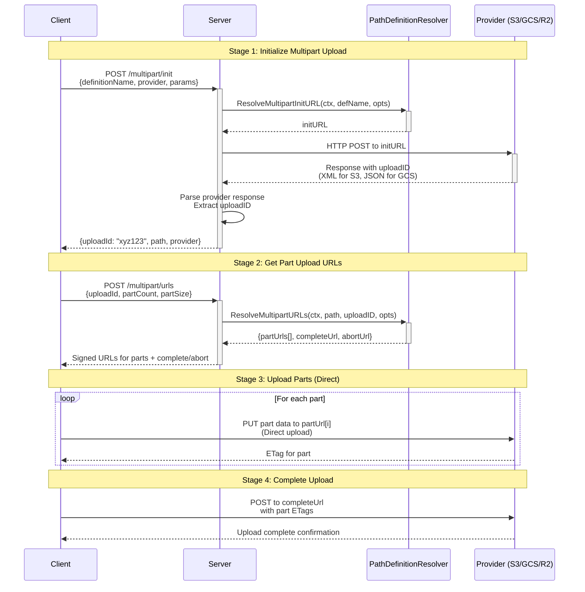

# Multipart Upload Flow

## Overview
Multipart uploads require a two-stage process where the client interacts with the server, and the server handles provider-specific operations.

## Flow Diagram



## Stage 1: Initialize Multipart Upload

### Client → Server
```
POST /multipart/init
{
  "definitionName": "user-avatar",
  "provider": "s3",
  "scope": "app",
  "scopeValue": 123,
  "paramResolver": { "userId": "user123" }
}
```

### Server Internal Flow
1. **Server** calls `PathDefinitionResolver.ResolveReadURL()`
2. **Server** gets provider-specific init URL
3. **Server** calls `provider.MultipartProvider.CreateInitMulpartUpload`
4. **Provider** returns response:
   - **S3/R2**: XML with `<UploadId>`, `<Bucket>`, `<Key>`
   - **GCS**: don't support multipart natively, simulate with resumable upload
5. **Server** parses provider response to extract `uploadID`

### Server → Client Response
```json
{
  "uploadId": "xyz123",
  "path": "users/user123/avatar.jpg",
  "provider": "s3"
}
```

## Stage 2: Get Part Upload URLs

### Client → Server
```
POST /multipart/urls
{
  "definitionName": "user-avatar", 
  "uploadId": "xyz123",
  "provider": "s3",
  "urlOptions": {
    "partCount": 5,
    "partSize": 5242880
  }
}
```

### Server Internal Flow
1. **Server** calls `PathURLResolver.ResolveMultipartURLs(path, uploadID, opts)`
2. **Server** gets signed URLs from provider

### Server → Client Response
```json
{
  "partUrls": [
    { "partNumber": 1, "url": "https://s3.amazonaws.com/bucket/path?partNumber=1&uploadId=xyz123&..." },
    { "partNumber": 2, "url": "https://s3.amazonaws.com/bucket/path?partNumber=2&uploadId=xyz123&..." }
  ],
  "completeUrl": "https://s3.amazonaws.com/bucket/path?uploadId=xyz123&complete",
  "abortUrl": "https://s3.amazonaws.com/bucket/path?uploadId=xyz123&abort"
}
```

## Stage 3: Upload Parts (Client Direct)

### Client → Provider (Direct)
- Client uploads parts directly to provider using part URLs
- Can upload parts in parallel
- No server involvement in actual data transfer

## Stage 4: Complete Upload

### Client → Provider (Direct)  
- Client calls `completeUrl` with part ETags
- Provider finalizes the multipart upload

## Architecture Benefits

1. **Security**: Server handles provider credentials, client never sees them
2. **Abstraction**: Client gets standardized responses regardless of provider
3. **Performance**: Direct client-to-provider upload for actual data
4. **Flexibility**: Server can implement provider-specific logic as needed

## Current Resolver Support

The existing `PathDefinitionResolver` and `PathURLResolver` in `resource/resolver.go` already support this flow:

- `ResolveMultipartInitURL()` - Gets init URL for Stage 1
- `ResolveMultipartURLs()` - Gets part URLs for Stage 2

The server application layer needs to handle the HTTP operations and provider response parsing.