# Resource Server API Flow Diagrams

## 1. System Architecture Overview

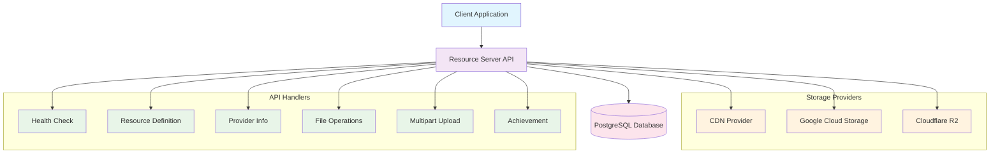

## 2. Health Check & Core APIs Flow

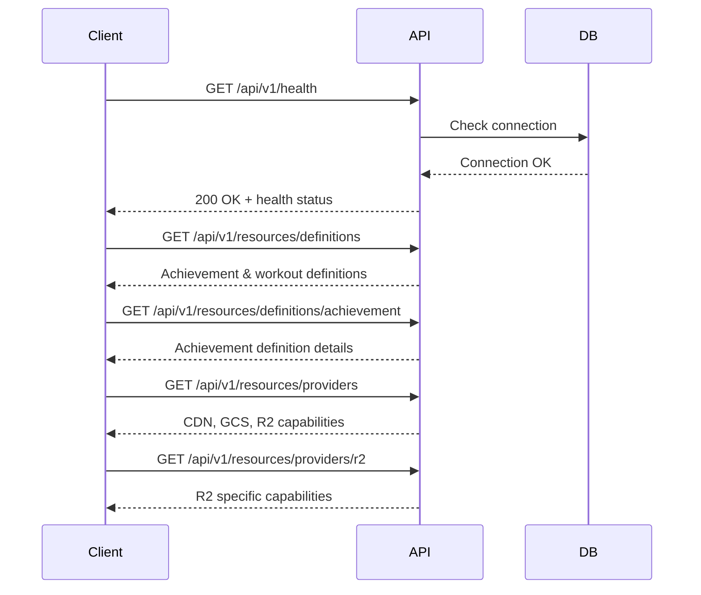

## 3. File Operations Flow

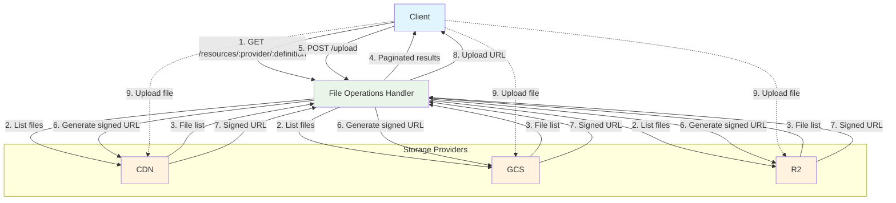

## 4. Download & Metadata Operations

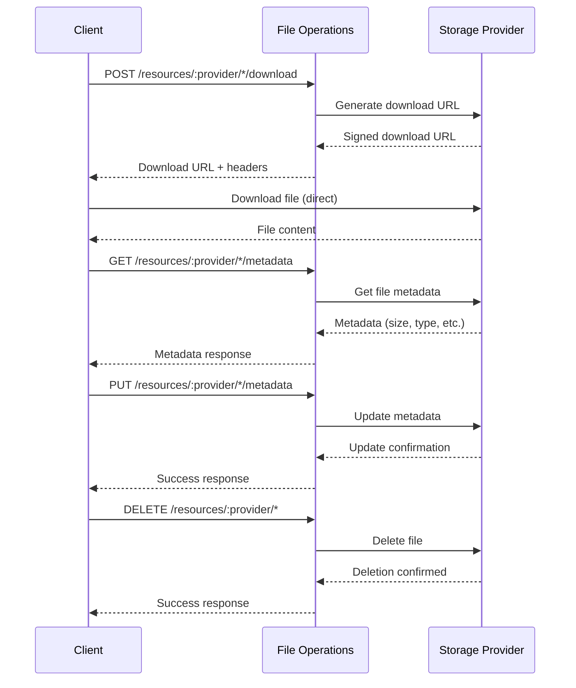

## 5. Multipart Upload Flow

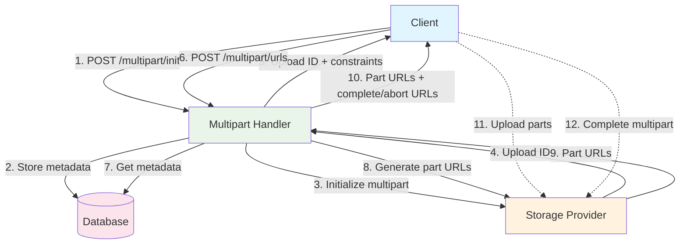

## 6. Achievement Management Flow

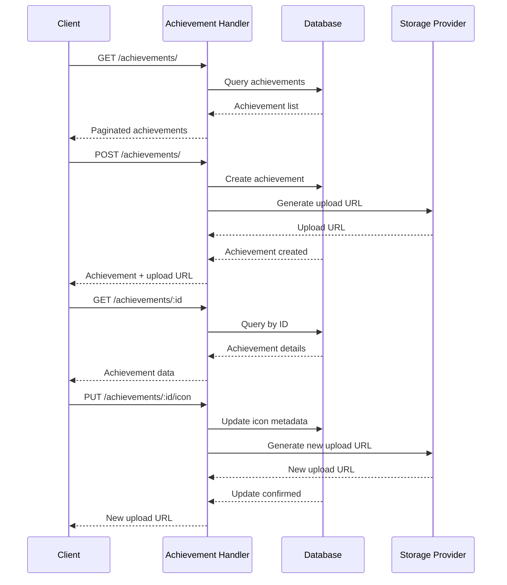

## 7. Upload Confirmation & Verification Flow

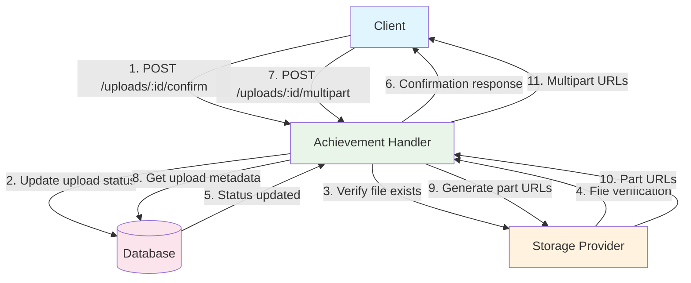

## Flow Summary

### Diagram 1: System Architecture
- Shows high-level system components and relationships
- 6 main handlers connecting client to storage providers and database

### Diagram 2: Health Check & Core APIs
- Simple request/response patterns for system status and configuration
- No complex business logic, just data retrieval

### Diagram 3: File Operations
- Multi-provider file listing and upload URL generation
- Shows both API flow and direct client-to-storage uploads

### Diagram 4: Download & Metadata
- Download URL generation and direct file access
- Metadata CRUD operations across providers

### Diagram 5: Multipart Upload
- Complex workflow for large file uploads
- Database tracking and multi-step URL generation

### Diagram 6: Achievement Management
- CRUD operations with integrated file upload support
- Database persistence with storage provider integration

### Diagram 7: Upload Confirmation
- Post-upload verification and status tracking
- Achievement-specific multipart upload workflows

Each diagram focuses on a specific domain, making them easier to read and understand while covering all the flows from your end-to-end test plan.

---

# Client-Server Communication Only

## 1. System Overview - Client-Server

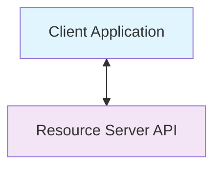

## 2. Health Check & Core APIs - Client-Server

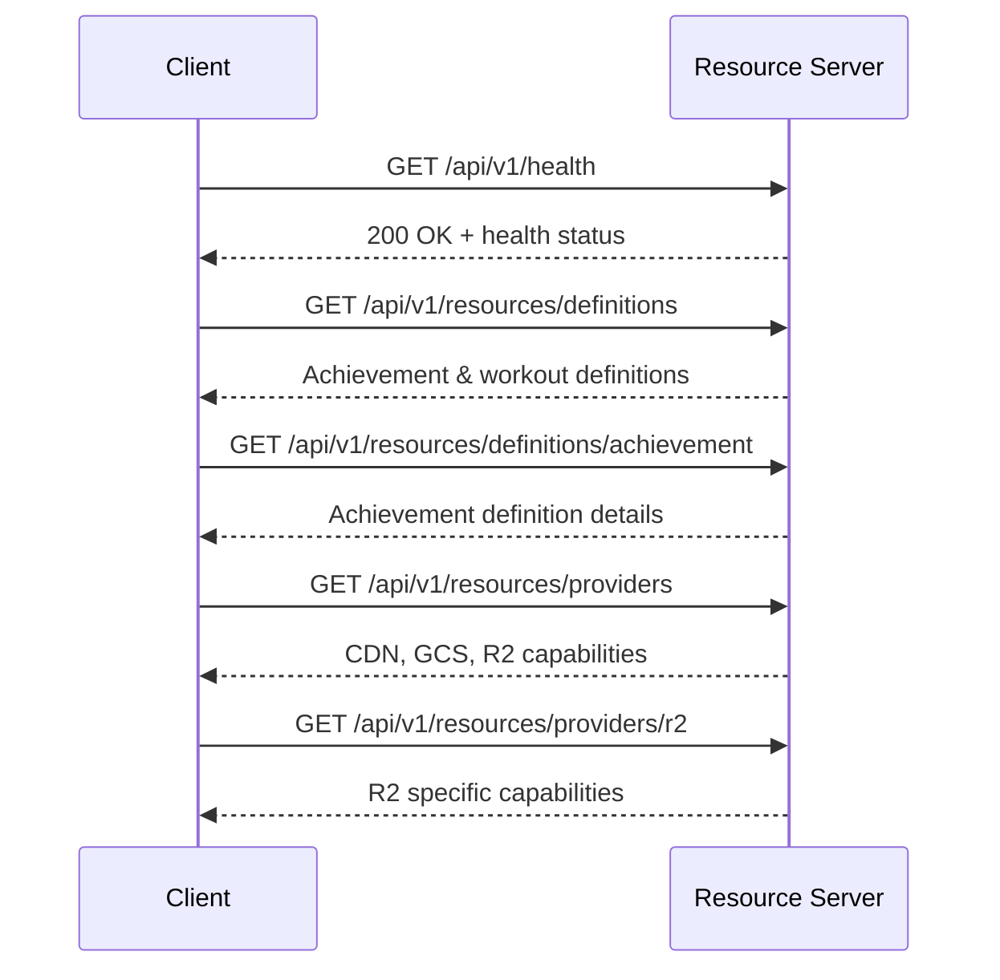

## 3. File Operations - Client-Server

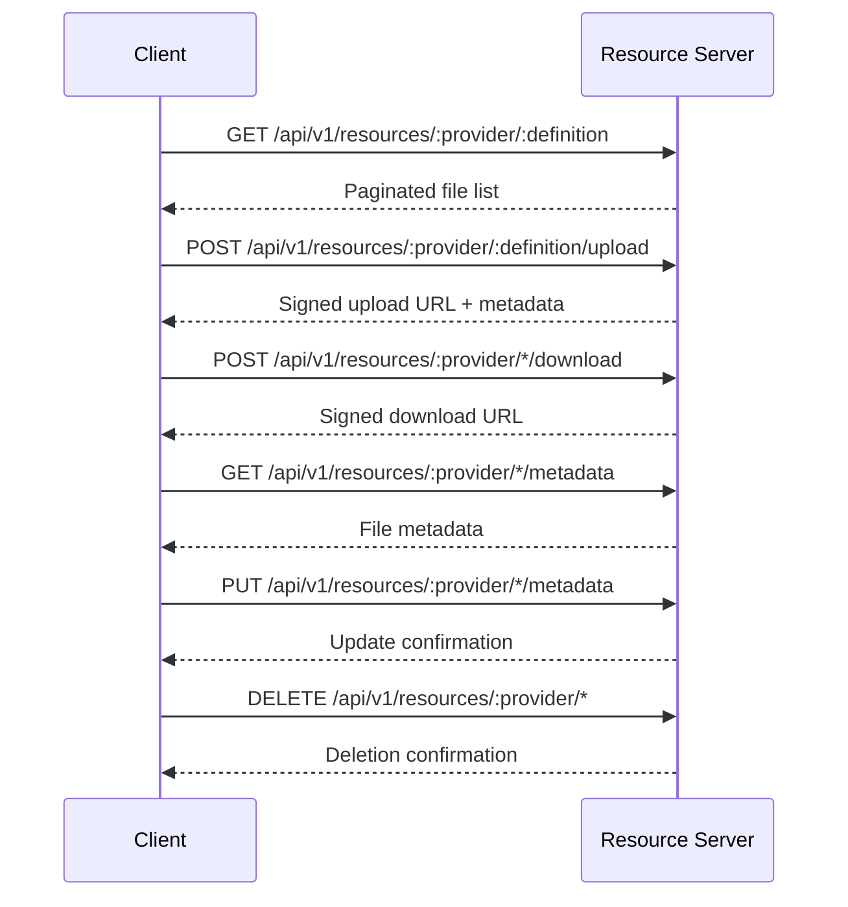

## 4. Multipart Upload - Client-Server

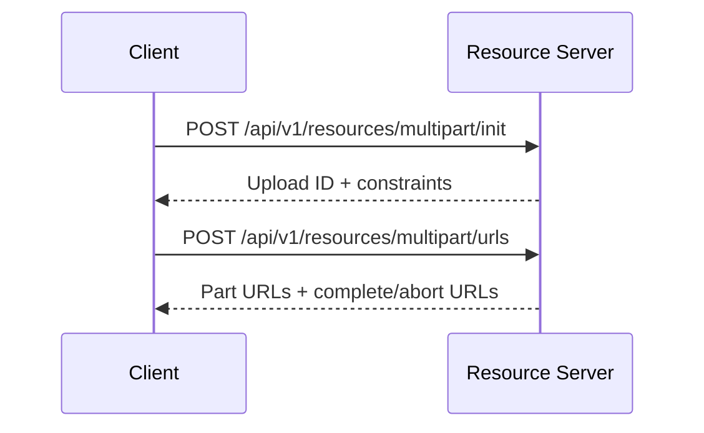

## 5. Achievement Management - Client-Server

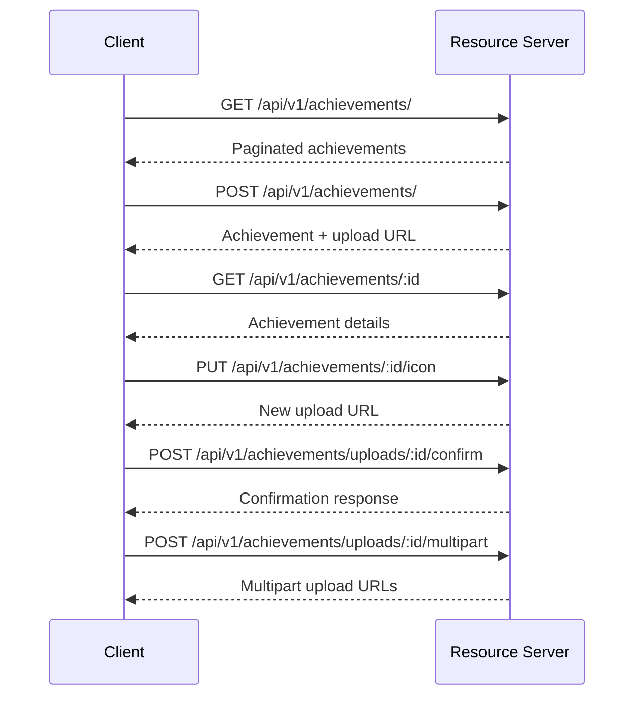

## 6. Complete API Endpoints Summary

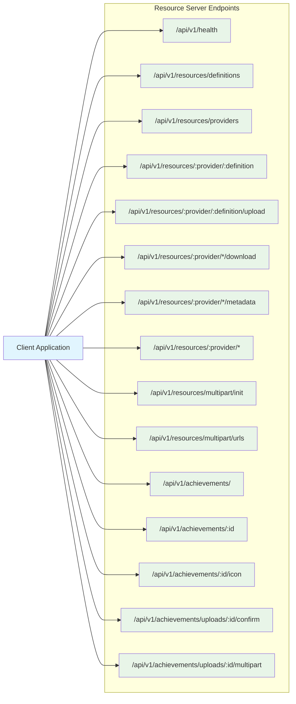