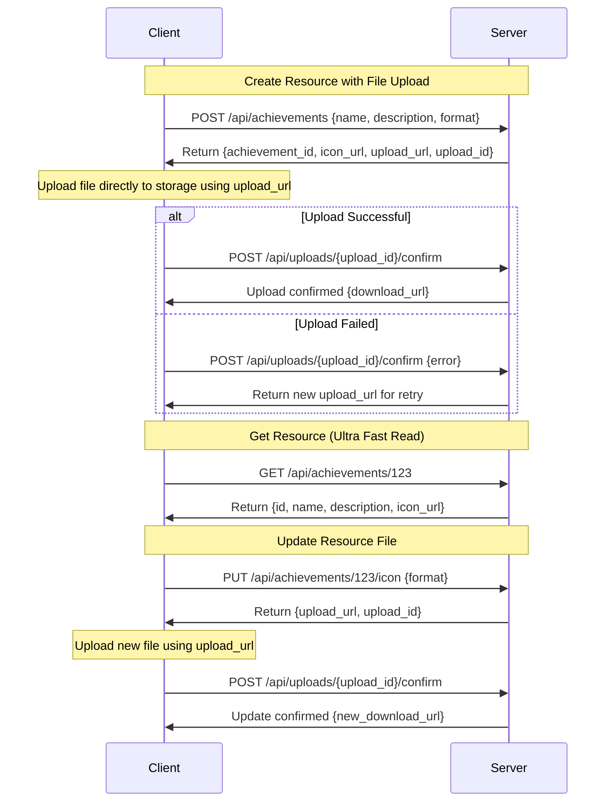

```mermaid
sequenceDiagram
    participant C as Client
    participant S as Server

    Note over C,S: Create Resource with File Upload
    
    C->>S: POST /api/achievements {name, description, format}
    S->>C: Return {achievement_id, icon_url, upload_url, upload_id}
    
    Note over C: Upload file directly to storage using upload_url
    
    alt Upload Successful
        C->>S: POST /api/uploads/{upload_id}/confirm
        S->>C: Upload confirmed {download_url}
    else Upload Failed
        C->>S: POST /api/uploads/{upload_id}/confirm {error}
        S->>C: Return new upload_url for retry
    end

    Note over C,S: Get Resource (Ultra Fast Read)
    
    C->>S: GET /api/achievements/123
    S->>C: Return {id, name, description, icon_url}

    Note over C,S: Update Resource File
    
    C->>S: PUT /api/achievements/123/icon {format}
    S->>C: Return {upload_url, upload_id}
    
    Note over C: Upload new file using upload_url
    
    C->>S: POST /api/uploads/{upload_id}/confirm
    S->>C: Update confirmed {new_download_url}
```